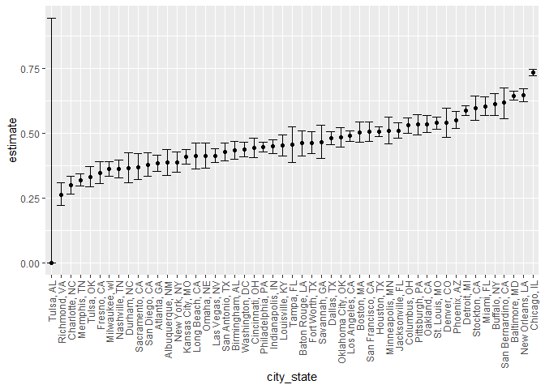
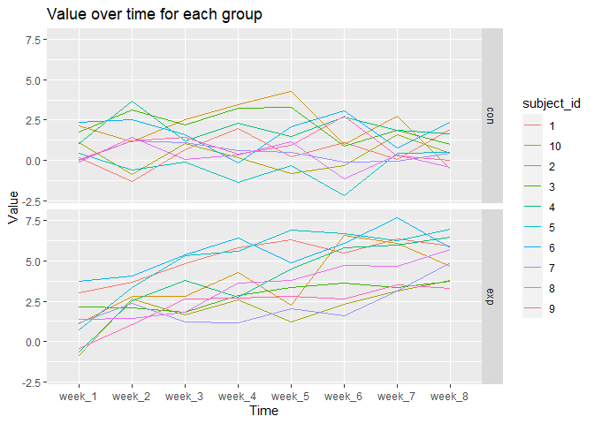
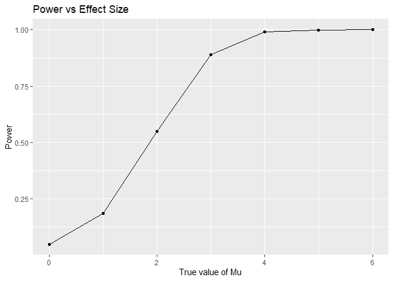
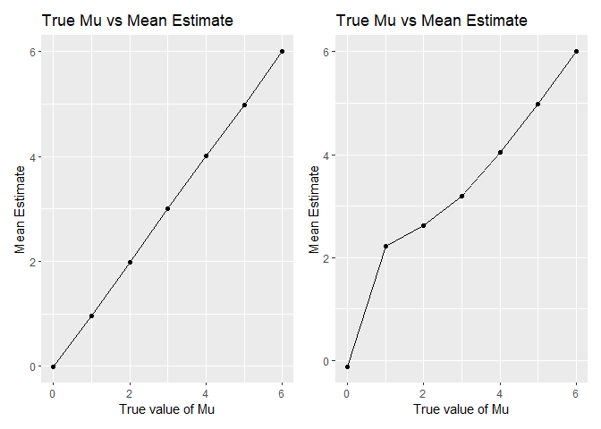

Homework 5
================
Adarsh Ramakrishnan

This is my homework 5 solution:

Loading libraries:

``` r
library(tidyverse)
```

    ## -- Attaching packages ----------------------------------------------- tidyverse 1.3.0 --

    ## v ggplot2 3.3.2     v purrr   0.3.4
    ## v tibble  3.0.3     v dplyr   1.0.2
    ## v tidyr   1.1.2     v stringr 1.4.0
    ## v readr   1.3.1     v forcats 0.5.0

    ## -- Conflicts -------------------------------------------------- tidyverse_conflicts() --
    ## x dplyr::filter() masks stats::filter()
    ## x dplyr::lag()    masks stats::lag()

``` r
library(patchwork)
```

## Problem 1

Load the homicide dataset -

``` r
homicide_df = read_csv("./data/homicide-data.csv")%>% 
janitor::clean_names()
```

    ## Parsed with column specification:
    ## cols(
    ##   uid = col_character(),
    ##   reported_date = col_double(),
    ##   victim_last = col_character(),
    ##   victim_first = col_character(),
    ##   victim_race = col_character(),
    ##   victim_age = col_character(),
    ##   victim_sex = col_character(),
    ##   city = col_character(),
    ##   state = col_character(),
    ##   lat = col_double(),
    ##   lon = col_double(),
    ##   disposition = col_character()
    ## )

The homicide dataset contains information about the homicides located in
various cities. It tells us the name of the victim, age of the victim,
sex of the victim, the state, city, and exact latitude and longitude
that the homicide took place in, the date the homicide was reported, and
the disposition status of the homicide case. The dataset has 52179
observations.

Let us now create city\_state variable and resolved variable

``` r
homicide_df = 
  
  homicide_df%>%
  mutate(city_state = str_c(city,", ", state))%>%
  mutate(resolved = case_when(
        disposition == 'Closed without arrest' ~   "unsolved",
        disposition == 'Open/No arrest' ~ "unsolved",
        disposition == 'Closed by arrest' ~ "solved"))   %>%
  select(city_state, resolved)%>%
  filter(city_state != "Tulsa_AL")
```

Group by and summarize to get total number of cases per city and number
of unsolved cases

``` r
homicide_aggregare_df = 
  
  homicide_df%>%
  group_by(city_state)%>%
  summarize(
    total_hom = n(),
    unsolved_hom = sum(resolved == "unsolved")
  )
```

    ## `summarise()` ungrouping output (override with `.groups` argument)

Using the prop test for a single city

``` r
prop.test(
homicide_aggregare_df%>%filter(city_state == "Baltimore, MD")%>% pull(unsolved_hom),
homicide_aggregare_df%>%filter(city_state == "Baltimore, MD")%>% pull(total_hom) 
)%>%
  broom::tidy()
```

    ## # A tibble: 1 x 8
    ##   estimate statistic  p.value parameter conf.low conf.high method    alternative
    ##      <dbl>     <dbl>    <dbl>     <int>    <dbl>     <dbl> <chr>     <chr>      
    ## 1    0.646      239. 6.46e-54         1    0.628     0.663 1-sample~ two.sided

Iteration..

``` r
results_df =
  homicide_aggregare_df%>%
  mutate(
    prop_tests = map2(.x = unsolved_hom, .y = total_hom, ~prop.test(x = .x, n = .y)),
tidy_tests = map(.x = prop_tests, ~broom::tidy(.x))    
    
  )%>%
  
  select(-prop_tests)%>%
  unnest(tidy_tests)%>%
  select(city_state, estimate, conf.low, conf.high)
```

    ## Warning: Problem with `mutate()` input `prop_tests`.
    ## i Chi-squared approximation may be incorrect
    ## i Input `prop_tests` is `map2(.x = unsolved_hom, .y = total_hom, ~prop.test(x = .x, n = .y))`.

    ## Warning in prop.test(x = .x, n = .y): Chi-squared approximation may be incorrect

``` r
results_df %>% 
  mutate(city_state = fct_reorder(city_state, estimate)) %>% 
  ggplot(aes(x = city_state, y = estimate)) +
  geom_point() + 
  geom_errorbar(aes(ymin = conf.low, ymax = conf.high)) + 
  theme(axis.text.x = element_text(angle = 90, vjust = 0.5, hjust = 1))
```

<!-- -->

## Problem 2

import one dataset

``` r
data_1 = read_csv("data_problem2/con_01.csv")
```

    ## Parsed with column specification:
    ## cols(
    ##   week_1 = col_double(),
    ##   week_2 = col_double(),
    ##   week_3 = col_double(),
    ##   week_4 = col_double(),
    ##   week_5 = col_double(),
    ##   week_6 = col_double(),
    ##   week_7 = col_double(),
    ##   week_8 = col_double()
    ## )

``` r
problem2_df = 
  tibble(
    filename = list.files("data_problem2")
  ) %>% 
  mutate(
    path = str_c("data_problem2/", filename),
    data = map(path, read_csv )
  )%>%
  unnest(data)%>%
  separate(filename, into = c("arm","subject_id","csv"), convert = TRUE )%>%
  select(arm, subject_id,week_1:week_8)%>%
  pivot_longer(
    week_1:week_8,
    names_to = "week_number",
    values_to = "value")%>%
  mutate(
    
    subject_id = as.character(subject_id)
  )
```

    ## Parsed with column specification:
    ## cols(
    ##   week_1 = col_double(),
    ##   week_2 = col_double(),
    ##   week_3 = col_double(),
    ##   week_4 = col_double(),
    ##   week_5 = col_double(),
    ##   week_6 = col_double(),
    ##   week_7 = col_double(),
    ##   week_8 = col_double()
    ## )
    ## Parsed with column specification:
    ## cols(
    ##   week_1 = col_double(),
    ##   week_2 = col_double(),
    ##   week_3 = col_double(),
    ##   week_4 = col_double(),
    ##   week_5 = col_double(),
    ##   week_6 = col_double(),
    ##   week_7 = col_double(),
    ##   week_8 = col_double()
    ## )
    ## Parsed with column specification:
    ## cols(
    ##   week_1 = col_double(),
    ##   week_2 = col_double(),
    ##   week_3 = col_double(),
    ##   week_4 = col_double(),
    ##   week_5 = col_double(),
    ##   week_6 = col_double(),
    ##   week_7 = col_double(),
    ##   week_8 = col_double()
    ## )
    ## Parsed with column specification:
    ## cols(
    ##   week_1 = col_double(),
    ##   week_2 = col_double(),
    ##   week_3 = col_double(),
    ##   week_4 = col_double(),
    ##   week_5 = col_double(),
    ##   week_6 = col_double(),
    ##   week_7 = col_double(),
    ##   week_8 = col_double()
    ## )
    ## Parsed with column specification:
    ## cols(
    ##   week_1 = col_double(),
    ##   week_2 = col_double(),
    ##   week_3 = col_double(),
    ##   week_4 = col_double(),
    ##   week_5 = col_double(),
    ##   week_6 = col_double(),
    ##   week_7 = col_double(),
    ##   week_8 = col_double()
    ## )
    ## Parsed with column specification:
    ## cols(
    ##   week_1 = col_double(),
    ##   week_2 = col_double(),
    ##   week_3 = col_double(),
    ##   week_4 = col_double(),
    ##   week_5 = col_double(),
    ##   week_6 = col_double(),
    ##   week_7 = col_double(),
    ##   week_8 = col_double()
    ## )
    ## Parsed with column specification:
    ## cols(
    ##   week_1 = col_double(),
    ##   week_2 = col_double(),
    ##   week_3 = col_double(),
    ##   week_4 = col_double(),
    ##   week_5 = col_double(),
    ##   week_6 = col_double(),
    ##   week_7 = col_double(),
    ##   week_8 = col_double()
    ## )
    ## Parsed with column specification:
    ## cols(
    ##   week_1 = col_double(),
    ##   week_2 = col_double(),
    ##   week_3 = col_double(),
    ##   week_4 = col_double(),
    ##   week_5 = col_double(),
    ##   week_6 = col_double(),
    ##   week_7 = col_double(),
    ##   week_8 = col_double()
    ## )
    ## Parsed with column specification:
    ## cols(
    ##   week_1 = col_double(),
    ##   week_2 = col_double(),
    ##   week_3 = col_double(),
    ##   week_4 = col_double(),
    ##   week_5 = col_double(),
    ##   week_6 = col_double(),
    ##   week_7 = col_double(),
    ##   week_8 = col_double()
    ## )
    ## Parsed with column specification:
    ## cols(
    ##   week_1 = col_double(),
    ##   week_2 = col_double(),
    ##   week_3 = col_double(),
    ##   week_4 = col_double(),
    ##   week_5 = col_double(),
    ##   week_6 = col_double(),
    ##   week_7 = col_double(),
    ##   week_8 = col_double()
    ## )
    ## Parsed with column specification:
    ## cols(
    ##   week_1 = col_double(),
    ##   week_2 = col_double(),
    ##   week_3 = col_double(),
    ##   week_4 = col_double(),
    ##   week_5 = col_double(),
    ##   week_6 = col_double(),
    ##   week_7 = col_double(),
    ##   week_8 = col_double()
    ## )
    ## Parsed with column specification:
    ## cols(
    ##   week_1 = col_double(),
    ##   week_2 = col_double(),
    ##   week_3 = col_double(),
    ##   week_4 = col_double(),
    ##   week_5 = col_double(),
    ##   week_6 = col_double(),
    ##   week_7 = col_double(),
    ##   week_8 = col_double()
    ## )
    ## Parsed with column specification:
    ## cols(
    ##   week_1 = col_double(),
    ##   week_2 = col_double(),
    ##   week_3 = col_double(),
    ##   week_4 = col_double(),
    ##   week_5 = col_double(),
    ##   week_6 = col_double(),
    ##   week_7 = col_double(),
    ##   week_8 = col_double()
    ## )
    ## Parsed with column specification:
    ## cols(
    ##   week_1 = col_double(),
    ##   week_2 = col_double(),
    ##   week_3 = col_double(),
    ##   week_4 = col_double(),
    ##   week_5 = col_double(),
    ##   week_6 = col_double(),
    ##   week_7 = col_double(),
    ##   week_8 = col_double()
    ## )
    ## Parsed with column specification:
    ## cols(
    ##   week_1 = col_double(),
    ##   week_2 = col_double(),
    ##   week_3 = col_double(),
    ##   week_4 = col_double(),
    ##   week_5 = col_double(),
    ##   week_6 = col_double(),
    ##   week_7 = col_double(),
    ##   week_8 = col_double()
    ## )
    ## Parsed with column specification:
    ## cols(
    ##   week_1 = col_double(),
    ##   week_2 = col_double(),
    ##   week_3 = col_double(),
    ##   week_4 = col_double(),
    ##   week_5 = col_double(),
    ##   week_6 = col_double(),
    ##   week_7 = col_double(),
    ##   week_8 = col_double()
    ## )
    ## Parsed with column specification:
    ## cols(
    ##   week_1 = col_double(),
    ##   week_2 = col_double(),
    ##   week_3 = col_double(),
    ##   week_4 = col_double(),
    ##   week_5 = col_double(),
    ##   week_6 = col_double(),
    ##   week_7 = col_double(),
    ##   week_8 = col_double()
    ## )
    ## Parsed with column specification:
    ## cols(
    ##   week_1 = col_double(),
    ##   week_2 = col_double(),
    ##   week_3 = col_double(),
    ##   week_4 = col_double(),
    ##   week_5 = col_double(),
    ##   week_6 = col_double(),
    ##   week_7 = col_double(),
    ##   week_8 = col_double()
    ## )
    ## Parsed with column specification:
    ## cols(
    ##   week_1 = col_double(),
    ##   week_2 = col_double(),
    ##   week_3 = col_double(),
    ##   week_4 = col_double(),
    ##   week_5 = col_double(),
    ##   week_6 = col_double(),
    ##   week_7 = col_double(),
    ##   week_8 = col_double()
    ## )
    ## Parsed with column specification:
    ## cols(
    ##   week_1 = col_double(),
    ##   week_2 = col_double(),
    ##   week_3 = col_double(),
    ##   week_4 = col_double(),
    ##   week_5 = col_double(),
    ##   week_6 = col_double(),
    ##   week_7 = col_double(),
    ##   week_8 = col_double()
    ## )

Let us now create the spaghetti plot of how the values change over time
for each treatment arm

``` r
problem2_df%>%
  ggplot(aes(x = week_number, y = value, color = subject_id, group = subject_id))+
  geom_line()+
  facet_grid( arm ~ .)+
  labs(title = "Value over time for each group", x = "Time", y = "Value")
```

<!-- -->

From the graph, it is clear that the values increase over time in the
experimental arm but stay relatively constant in the control arm. The
values start at about the same average value in the beginning for both
groups, but over time, the values in the experimental group increase and
are greater than those in the control group.

## Problem 3

Let us create the simulation function

``` r
simulation = function(n = 30, mu, sigma = 5) {
  
  sim_data = tibble(
    x = rnorm(n, mean = mu, sd = sigma)
  )
  
  sim_data %>% 
  t.test()%>%
  broom::tidy()%>%
  select(estimate, p.value)
    
}
```

Now let us run the simulation 5000 times for mu values ranging from 0 to
7 and save the results in a tibble

``` r
sim_results = tibble(true_mu = c(0,1,2,3,4,5,6)) %>% 
  mutate(
    output = map(.x = true_mu, ~rerun(5000, simulation(mu = .x))),
    combined_output = map(output, bind_rows)) %>% 
  select(-output) %>% 
  unnest(combined_output)
```

With the final dataset, we can make a plot showing the proportion of
times the null was rejected vs the true value of mu

``` r
sim_results%>%
  mutate(reject = case_when(
    
    p.value < 0.05 ~ 1,
    p.value >= 0.05 ~ 0
    
  ))%>%
  group_by(true_mu)%>%
  summarize(power = sum(reject)/n()  )%>%
  ggplot(aes(x = true_mu, y=power))+
  geom_point()+
  geom_line()+
  labs(title = "Power vs Effect Size", x = "True value of Mu", y = "Power")
```

    ## `summarise()` ungrouping output (override with `.groups` argument)

<!-- --> It
is clear that as the true value of mu or effect size increases, power
increases as well. Hence power and effect size are directly associated.

Now let us make a second visualization of the average value of the
estimate vs the true value of mu for all samples and for samples where
null was rejected

``` r
plot_1 =
  
  sim_results%>%
  mutate(reject = case_when(
    
    p.value < 0.05 ~ 1,
    p.value >= 0.05 ~ 0
    
  ))%>%
  group_by(true_mu)%>%
  summarize(mean_estimate = mean(estimate))%>%
  ggplot(aes(x = true_mu, y = mean_estimate))+
  geom_point()+
  geom_line()+
  labs(title = "True Mu vs Mean Estimate", x = "True value of Mu", y = "Mean Estimate")
```

    ## `summarise()` ungrouping output (override with `.groups` argument)

``` r
plot_2 = 
  
  sim_results%>%
  mutate(reject = case_when(
    
    p.value < 0.05 ~ 1,
    p.value >= 0.05 ~ 0
    
  ))%>%
  filter(reject == 1)%>%
  group_by(true_mu)%>%
  summarize(mean_estimate = mean(estimate))%>%
  ggplot(aes(x = true_mu, y = mean_estimate))+
  geom_point()+
  geom_line()+
  labs(title = "True Mu vs Mean Estimate", x = "True value of Mu", y = "Mean Estimate")
```

    ## `summarise()` ungrouping output (override with `.groups` argument)

Adding the two plots together,

``` r
plot_1 + plot_2
```

<!-- -->

It is clear that the sample average of the estimate values does not
equal to the true mu values closely when looking at the sample where
null is rejected. These values do match closely in the total sample.

This discrepancy is because in the sample where the null is rejected,
estimate values for the lower mu values that are closer to the null
value of 0 (such as 0 and 1) are going to be skewed higher or away from
zero, making them different from the true value of mu.
